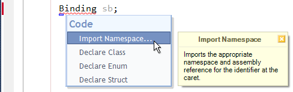
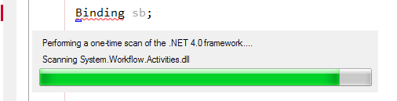
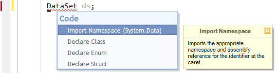
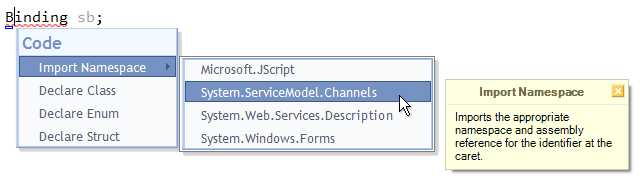
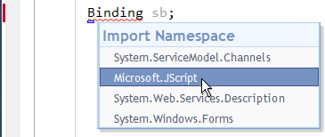

# 'Import Namespace' for CodeRush #
Ever started to write code that uses a type, only to discover that you haven't imported the namespace the type lives in?

Ever gone a stage further, and used a type whose assembly isn't even referenced?

These situations are obviously solvable, but their existing solutions are a pain...

###The Existing Solutions###
If the case of a missing assembly reference, your only real option is to use one of 2 'Add Reference' dialogs. The original one that comes with Visual Studio is extremely slow. the exercise of populating it is mind numbing. 

Alternatively it's successor (Previewing in the Microsoft Productivity Power Tools and available in VS11) is a little better, but again the caching is still very slow.

After this, or on those occasions where you don't need to add an assembly, you still need to visit the top of the relevant file, add a namespace reference ('Imports' or 'using' statement) and then return to the point you started from. 

There really should be a better way... Enter CR_ImportNamespace

### The Real Solution ###
In the usual tradition of CodeRush, this plugin provides it's functionality without using a modal dialog. Such distractions take you out of your code, and away from what you're doing. (Solving business problems.)

Instead it will present you with a list of candidate namespaces and allow you to pick the one you wish you'd already added. It will then import the namespace and even add a reference to the appropriate assembly if needed.

Oh and by the way... This namespaces covered by this plugin aren't limited to ones already in, or referenced by, the current solution. CR_ImportNamespace will scan **the entire framework** for appropriate namespaces.

### Usage ###
Simply place your caret on an undeclared type reference, and choose "Import Namespace" from the Code menu.

For each new framework target that you operate against, there will be a *one time only* caching operation. I just ran for the first time on the .Net 3.5 framework and it took 30 seconds. Successive Imports are immediate.

After that, successive invocations should show you either a single entry...

...or a choice of namespaces which contain a type by that name.

In either case, choosing a namespace, results in CodeRush adding a namespace reference (imports\using directive) at the top of the current file, and adding an assembly reference if needed.

You can also [bind a key](http://community.devexpress.com/blogs/rorybecker/archive/2010/10/05/binding-keys-in-coderush.aspx) to the new ImportNamespace command, which will trigger this menu...

...without the additional Code and/or Refactor menu items that come with the normal SmartTag.
